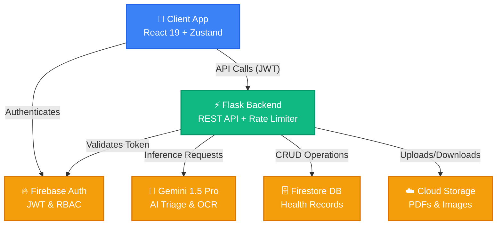

<div align="center">
  
  
  # 🏥 OneHealth: Your Digital Health Passport
  
  **A secure, AI-augmented digital health record system built for the modern healthcare ecosystem.**

  [](https://hackverse.com)
  [](https://aistudio.google.com)
  [](https://reactjs.org/)
  [](https://flask.palletsprojects.com/)
  [](https://firebase.google.com/)

</div>

---

## 🚀 The Problem & Our Solution
**The Problem:** Medical records are fragmented across hospitals, clinics, and paper files. Patients lack ownership of their data, and in emergencies, crucial health history is often inaccessible, leading to delayed or incorrect treatments.

**The Solution:** **OneHealth** is a decentralized, patient-centric digital passport that consolidates medical history into a cryptographically-secured profile. It enables seamless sharing with healthcare professionals while giving patients total control over their data.

---

## ✨ Killer Features (Why Judges Will Love This)

- **🤖 Gemini-Powered AI Triage & OCR:** Instantly analyze symptoms, predict health risks, and extract structured data from uploaded medical reports using Google Gemini 1.5 Pro.
- **🛡️ Consent-Gated Doctor Access:** Doctors can only view timelines and add diagnoses/prescriptions if the patient grants active consent. Privacy by design.
- **🚨 24-Hour Emergency Card:** Generate a time-limited, tokenized emergency share link for first responders to access critical data (blood type, allergies) instantly.
- **💊 Intelligent Medication Tracking:** Automated adherence logging and APScheduler-driven reminders via FCM Push Notifications.
- **📄 Instant PDF Health Reports:** Export your complete medical summary into a beautifully formatted ReportLab-generated PDF with one click.
- **🔐 Enterprise-Grade Security:** Firebase Auth with custom JWT claims (RBAC) and Python decorator-based authorization, ensuring zero data leaks.

---

## 🛠️ Ecosystem Architecture



---

## 💻 Tech Stack Summary

| Domain | Technologies |
|---|---|
| **Frontend App** | React 19, Vite 8, TailwindCSS 4, Zustand, Axios |
| **Backend API** | Flask 3, Gunicorn, Pydantic, APScheduler |
| **Database & Auth** | Firebase Admin SDK 6 (Firestore, Cloud Storage, Auth) |
| **AI Integration** | Google Gemini 1.5 Pro (via Google Generative AI) |
| **DevOps & Testing** | Docker, Pytest, Sentry SDK, ReportLab |

---

## 🚀 Quick Start (Bootstrapping)

### 1. Clone & Setup Backend
```bash
git clone https://github.com/your-org/onehealth.git
cd onehealth/HealthOne/backend

python -m venv .venv
# Windows: .venv\Scripts\activate | Mac/Linux: source .venv/bin/activate
pip install -r requirements.txt

# Configure your .env based on .env.example
python app.py
```

### 2. Setup Frontend
```bash
cd ../frontend
npm install

# Configure your .env based on .env.example
npm run dev
```

### 3. Docker Deploy (Optional)
```bash
docker compose up --build
```

---

## 🧪 Testing & CI/CD
Our backend features comprehensive test coverage spanning unit tests, integration tests, and full E2E journeys.
```bash
cd backend
pytest tests/ -v --cov=. --cov-report=term-missing
```

---

## 🔒 Security Posture
- **Stateless Auth:** JWTs are verified server-side on every request. No raw tokens are stored by the client.
- **Role-Based Access Control (RBAC):** Strict isolation between `patient`, `doctor`, and `admin` roles via custom claims.
- **Rate Limiting:** Sliding-window rate limiters prevent brute force and API abuse.
- **Secret Management:** Secrets are injected via environment variables. `firebase_credentials.json` is safely stored.

---

<div align="center">
  <b>Built with ❤️ for Hackverse 2026</b>
</div>
